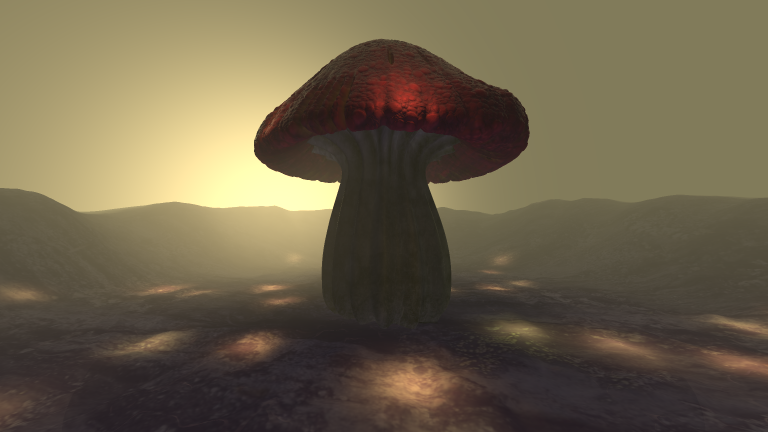
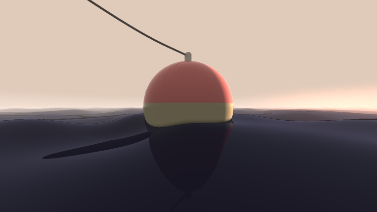
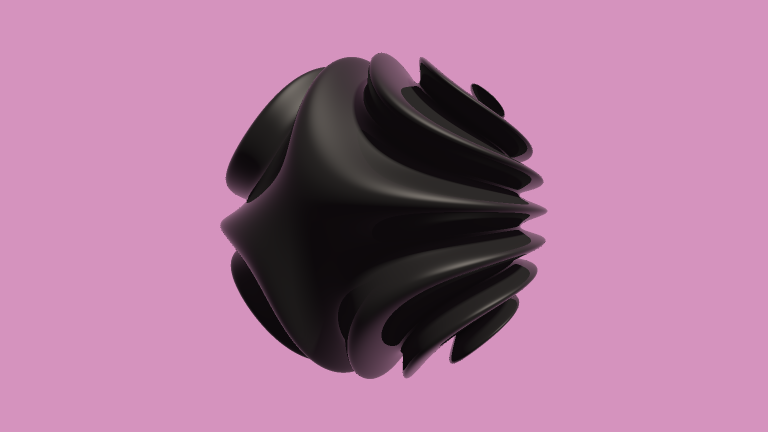
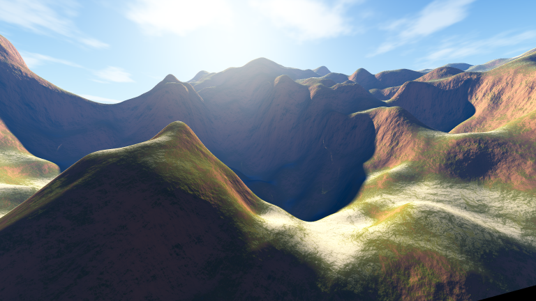
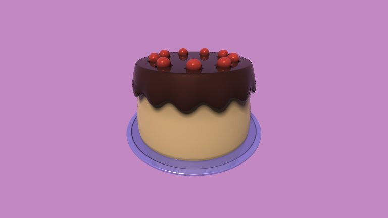
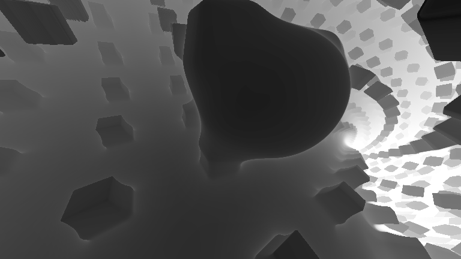
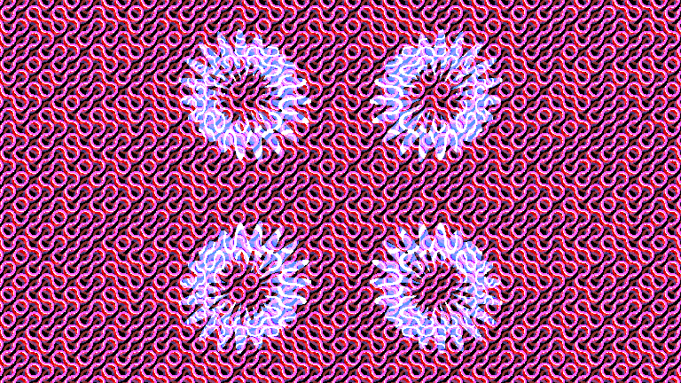
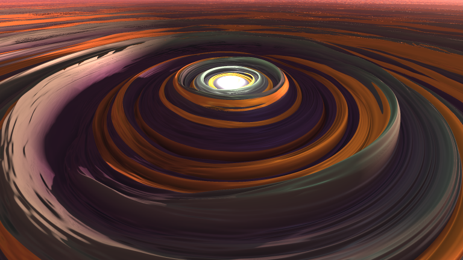

# Shadertoy Projects

This is heap collection of my Shadertoy coding projects since 2020.
My profile can be found [here](https://www.shadertoy.com/profile/?show=shaders).

I posted a lot of these projects on my Instagram (@prishainabox), which contains a mix of traditional, digital, and creative coding art.

# Folders
- SHOWCASE
- Tutorials: Programs that I wrote while being guided by online tutorials (some are in Showcase, however).
- Two-Dimensional
- 

# Gallery
- Awkward Mushroom  \
- Equilibrium  \
- Gogble  \
- Winter Denoument  \
- Code Cake 
- Learning Again 
- Randomness + Truchet Tiles 
- Swirly Swirls 

## Notes:
- As I had not learned about college-level coding standards when creating most of the projects, the code is extremely messy. Please let me know if anything is confusing.
- I have done my best to include which sources I used when learning. PLEASE let me know if I have missed anything.
- If you have any suggestions on better ways to showcase and store my code, please let me know.
- Please forgive (or be amused by) the silly titles if you decide to follow the link to the live programs. :D